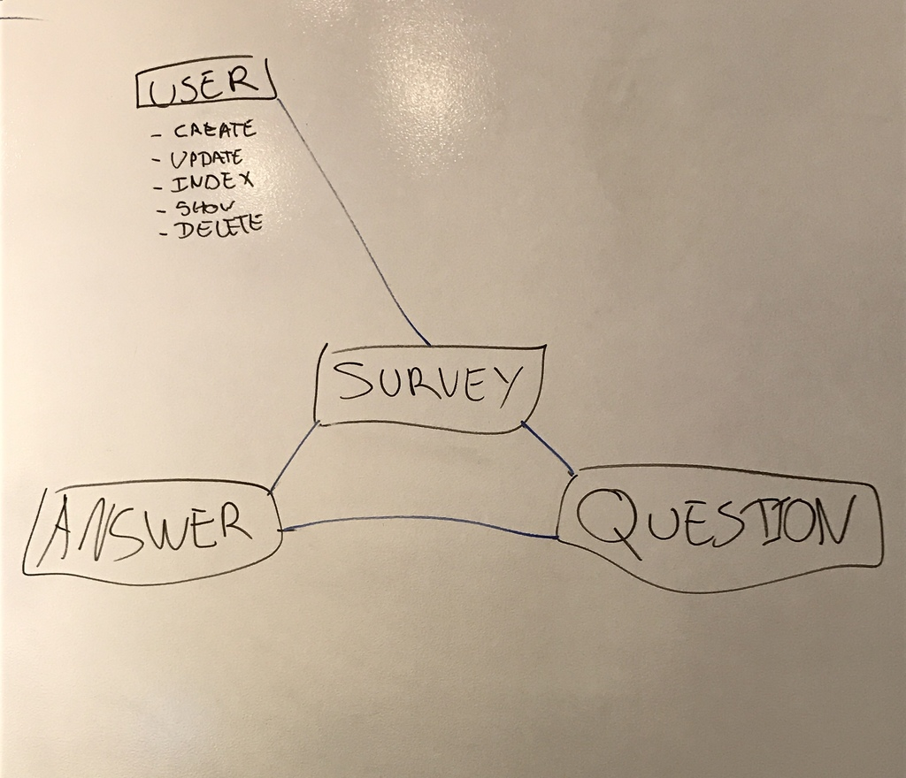
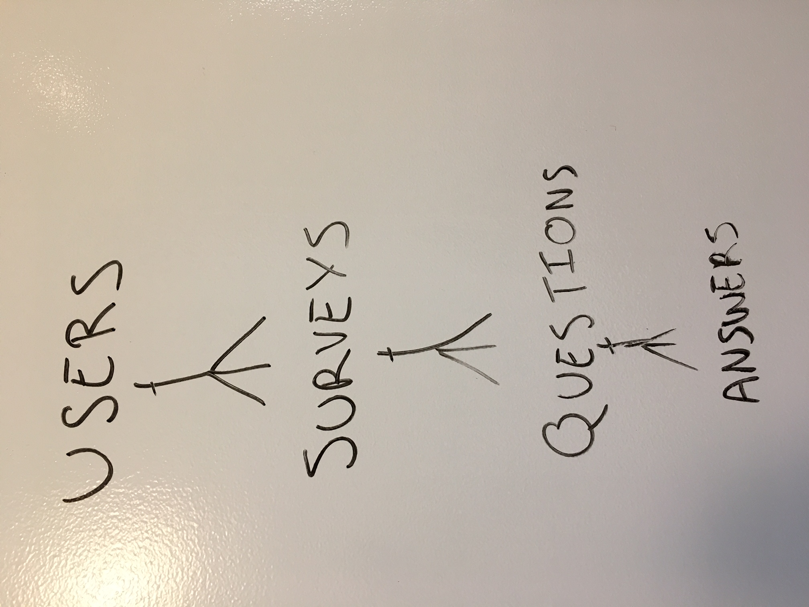

# About

This survey team project back end allows it's front end to have
authorization, and to create, read, update, and delete users, surveys,
questions, and answers.

## Team Members

Maxime Dore
Gabrielle Williams
Zhu Chen
Jana Ryndin

## Tasks

Make an app that can be used to create custom surveys and collect the responses
on a dashboard for that particular survey.

## User Stories

####As a user I want to:
-   Create a survey
-   Add questions to my sureys
-   Anwer anyone's survey questions
-   Have a statistic about surveys

## ERD

1st ERD:

2nd ERD:

## Development

1. Consulted with consultants regarding requirements and technical details of
development.
2. Each member of the team made sure we the same page regarding what we wanted to
create and how to go about the development.
3. Started with back end. developed CRUD actions for surveys and tested them.
4. Had the owners have ownership of surveys and tested them.
5. Create basic forms on the front end to test CRUD actions with back end.
6. Create and read actions worked but the update action for a new question was
problematic because it was replacing the already existing question and was not
adding a new question to the array. The solution being pushing the new
question to the survey array of question in the update controller.
7. We tested the update action on the backend and front end.
8. Used handlebars to diplay all surveys, questions, and answers.
9. Began working on getting the "submit answer" to work which is also a PATCH on
the survey. This was quite challenging.
10. Then added 'add question form' to survey handlebars, so it would display on each survey.
11. Made sure only the author of the survey could add questions or delete
12. For each action, had the survey index function run afterwards to update surveys.
13. Fixed sign up confirmation bug.
14. Added message div to display whether each action was a success or failure.
15. Displayed each survey stats.
16. Deployed.
